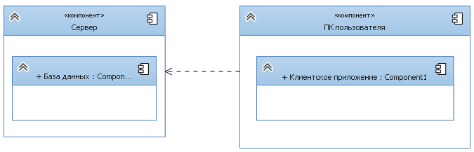
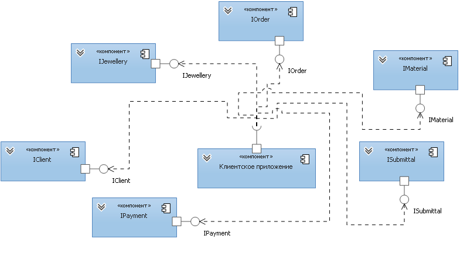
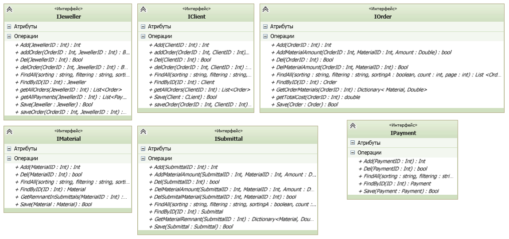

# Ювелирная мастерская
## Диаграмма размещения

На диаграмме размещения изображены узлы выполнения программных компонентов, а также объектов. Показано, что клиентское приложение, 
установленное на компьютере пользователя, взаимодействует с сервером, который содержит в себе базу данных.
## Диаграмма компонентов

На данной диаграмме изображены все компоненты: клиентское приложение, заказы, ювелиры, клиенты, платежи, филиалы, материалы. 
Эти компоненты взаимодействуют друг с другом с помощью интерфейсов. 
## Диаграммы интерфейсов

## Список всех интерфейсов

* [IOrder] (#IOrder);
* [IJeweller](https://github.com/saramampco/oop/blob/master/docs/IJeweller.md);
* [IClient] (https://github.com/saramampco/oop/blob/master/docs/IClient.md);
* [ISubmittal] (https://github.com/saramampco/oop/blob/master/docs/ISubmittal.md);
* [IMaterial] (https://github.com/saramampco/oop/blob/master/docs/IMaterial.md);
* [IPayment] (https://github.com/saramampco/oop/blob/master/docs/IPayment.md);